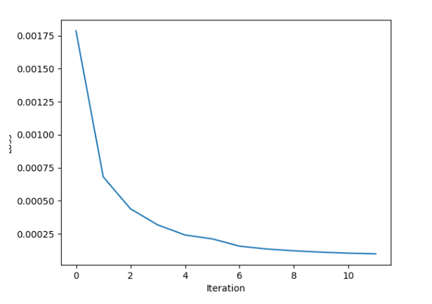

# Linear Regression for Steel Strength Prediction 📈

This project focuses on predicting the strength of steel using linear regression. The dataset contains information about metal alloys, including various chemical elements used in their creation, as well as the yield strength of the alloy, which is measured as the point of proportional deformation.

## Dataset Description 📊

The dataset includes the following variables:

| Variable | Description |
| --- | --- |
| c | Carbon content in the alloy |
| mn | Manganese content in the alloy |
| si | Silicon content in the alloy |
| cr | Chromium content in the alloy |
| ni | Nickel content in the alloy |
| mo | Molybdenum content in the alloy |
| v | Vanadium content in the alloy |
| n | Nitrogen content in the alloy |
| nb | Niobium content in the alloy |
| co | Cobalt content in the alloy |
| w | Tungsten content in the alloy |
| al | Aluminum content in the alloy |
| ti | Titanium content in the alloy |
| yield strength | Steel strength value (target variable) |

## Code Example 💻

The provided code demonstrates the implementation of linear regression using gradient descent to predict steel strength based on the given dataset. The code uses the `steel_strength.csv` file as input.

The steps covered in the code include:
1. Reading and preprocessing the data.
2. Implementing the loss function and gradient calculations.
3. Applying gradient descent for optimization.
4. Checking the performance using sklearn's linear regression model.
5. Plotting the results.

Feel free to explore the code and modify it to suit your needs.

## Usage 🚀

To run the code, follow these steps:
1. Ensure that you have Python installed on your system.
2. Clone the repository and navigate to the `Linear-Regression` directory.
3. Install the required dependencies (numpy, matplotlib, scikit-learn) if needed.
4. Execute the code using the command: `python linear_regression.py`.

## Results and Visualization 📊

The code has been executed with the following results:
- The program performed 1200 iterations to achieve an accuracy of 0.00009 on the training dataset and 0.0003 on the test dataset.
- The obtained results were compared with the ready-made solution of linear regression from the sklearn module, which yielded a result of 0.00009.

### Learning Curve
You can uncomment the function call to `plot_losses(losses)` in the code to visualize the learning curve. The learning curve shows the loss function value over iterations.

## Contributions 🤝

Contributions to this project are welcome! If you have any improvements, bug fixes, or additional features to contribute, feel free to submit a pull request.

Let's explore the relationship between alloy composition and steel strength using linear regression! 🚀🔬

